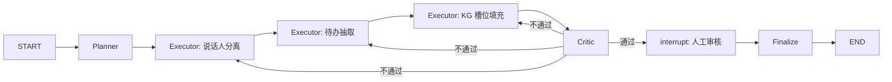

# 多 Agent 智能会议纪要系统

基于 **LangGraph** 的 **Plan-Executor-Critic** 架构，实现说话人分离、待办抽取、行动项知识图谱槽位填充，并配备 **人工审核队列** 与 **SSE 流式前端**（Zustand 状态管理 + Human-in-the-loop）。

## 架构



| 角色 | 职责 |
|------|------|
| **Planner** | 根据转写生成多步计划（diarize → extract → structure） |
| **Executor** | 三类执行节点：说话人分段、待办识别、行动项 KG 结构化 |
| **Critic** | 规则 + LLM 评审；不通过则按 `retry_target` 打回，最多 `max_retries` 次 |
| **Human** | `interrupt_before=["human_review"]` 暂停图；审核后 `resume` 进入 `finalize` |

### 知识图谱槽位（行动项）

`action_id`, `action_type`, `title`, `owner`, `due_date`, `priority`, `related_entities`, `dependencies`, `source_utterance_ids`, `confidence`

定义见 `backend/app/kg/slots.py`。

## 快速开始

### 后端

```bash
cd backend
python -m venv .venv
.venv\Scripts\activate   # Windows
pip install -r requirements.txt
copy .env.example .env   # 可选：配置 OPENAI_API_KEY
cd ..
python -m uvicorn app.main:app --app-dir backend --reload --port 8000
```

默认 **Mock 模式**（`USE_MOCK_LLM=true` 或无 API Key）：使用规则/heuristic 演示全流程，无需付费模型。

### 前端

```bash
cd frontend
npm install
npm run dev
```

注意该前端需要运行在npm18下，可以使用nvm进行版本控制
浏览器打开 http://localhost:5173 ，点击「加载示例」→「启动多 Agent 流水线」，观察 SSE 阶段事件与审核队列。

## API

| 方法 | 路径 | 说明 |
|------|------|------|
| POST | `/api/meetings/process` | 提交转写，异步跑图，返回 `meeting_id` |
| GET | `/api/meetings/{id}/stream` | SSE 流式阶段/状态事件 |
| GET | `/api/meetings/{id}/state` | 查询 LangGraph checkpoint 状态 |
| GET | `/api/review-queue` | 待人工审核列表 |
| GET | `/api/review-queue/{id}` | 审核详情 |
| POST | `/api/review-queue/{id}/decide` | `approved` / `rejected` / `edited` + 可选 `edits` |

## 为何选 LangGraph 而非 AutoGen

- 原生 **StateGraph**、条件边与 **checkpoint** 适合流水线状态机
- **`interrupt_before`** 一等公民支持 HITL，无需额外编排审核暂停
- **astream** 与 SSE 对接简单，便于前端实时展示 `phase` 迁移

AutoGen 更擅长对话式多 Agent 协商；本场景是固定 DAG + 质量门禁 + 人工闸口，LangGraph 更贴切。

## 目录结构

```
backend/app/
  agents/       # planner, executor, critic
  graph/        # state, nodes, workflow (LangGraph)
  kg/           # 槽位 schema 与校验
  store/        # 审核队列 + SSE 事件总线
  main.py       # FastAPI
frontend/src/
  store/        # Zustand 全局状态
  hooks/        # useMeetingStream (SSE)
  components/   # 流水线、发言轴、KG 卡片、审核队列
```

## Docker 云服务器部署

### 前置条件

- 云服务器已安装 Docker 与 Docker Compose v2
- 安全组放行 `HTTP_PORT`（默认 **80**）

### 步骤

```bash
# 1. 上传代码或 git clone 到服务器
cd /opt/aiagent   # 项目根目录

# 2. 配置环境变量
cp .env.example .env
# 编辑 .env：设置 OPENAI_API_KEY、USE_MOCK_LLM=false 等

# 3. 构建并启动
docker compose up -d --build

# 4. 查看状态
docker compose ps
docker compose logs -f
```

浏览器访问：`http://<服务器公网IP>/`

- 前端由 **Nginx** 提供静态页面，并将 `/api`、`/health` 反代到 `backend:8000`
- SSE 流式路径已单独配置 `proxy_buffering off`
- 后端不对外暴露端口，仅在内网 `meeting-net` 中通信

### 常用命令

```bash
docker compose down          # 停止并删除容器
docker compose up -d --build # 更新代码后重新构建
docker compose logs backend  # 查看后端日志
```

### 使用 HTTPS（可选）

在云厂商负载均衡 / CDN 终结 TLS，或自行在宿主机用 Caddy / 另一层 Nginx 反代到 `80` 端口。

若需容器内 HTTPS，可将证书挂载到 Nginx 并改用 `docker-compose.https.yml`（见仓库内注释示例）。

### 文件说明

| 文件 | 说明 |
|------|------|
| `docker-compose.yml` | 编排 frontend + backend |
| `backend/Dockerfile` | Python 3.11 + Uvicorn |
| `frontend/Dockerfile` | Node 构建 + Nginx 运行 |
| `frontend/nginx.conf` | 静态资源 + API/SSE 反代 |
| `.env.example` | 环境变量模板 |

## 扩展建议

- 接入真实 ASR + pyannote 说话人分离
- 将 `ReviewQueueStore` 换为 Redis/PostgreSQL
- 使用 LangGraph PostgresSaver 持久化 checkpoint
- `edited` 决策时在前端 JSON 编辑器中修改 `action_items` 再提交
